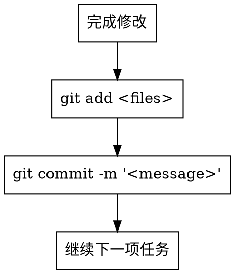
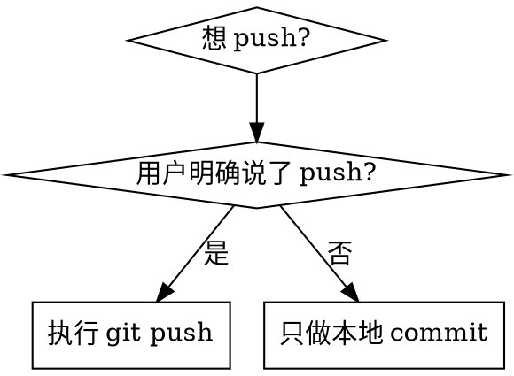

# Git 本地管理纪律

## 概述

修改文件而不提交，等于没有版本控制。未经许可就推送，等于越权操作。

**核心原则：** 每次修改即提交，本地 commit 优先，push 需要明确授权。

**违反规则的字面意思就是违反规则的精神。**

## 铁律

```
没有未提交的修改留在工作区
没有未经授权的 push
没有模糊的 commit message
```

## 三大规则

### 规则一：修改即提交

**每次完成一组相关修改后，必须立即 `git add` + `git commit`。**



**关键点：**
- 一组逻辑相关的修改 = 一个 commit（原子性提交）
- 修改完成后**立即**提交，不要攒着
- 提交前检查 `git status` 确认变更范围
- 提交后检查 `git log --oneline -1` 确认提交成功

**示例：**
```bash
# 修改了文件后
git status                          # 检查变更
git add app/src/main/java/.../Foo.kt  # 暂存
git commit -m "fix(阅读): 修复翻页闪烁问题"  # 提交
git log --oneline -1                # 确认
```

### 规则二：禁止未授权 push

**在用户明确说"push"之前，只做本地 commit，绝不执行 `git push`。**



**"明确许可"的标准：**
- ✅ 用户说"push 吧" / "推上去" / "可以 push 了"
- ✅ 用户说"合并到远程" / "提交到远程"
- ❌ 用户说"提交" — 这只意味着 `git commit`
- ❌ 用户说"保存" — 这只意味着 `git add` + `git commit`
- ❌ 你觉得"应该 push 了" — 这不是许可
- ❌ 之前许可过 push — 每次都需要重新许可

### 规则三：Commit Message 规范

**必须使用 Conventional Commits 中文格式：**

```
<type>(<scope>): <description>
```

| 类型 | 用途 | 示例 |
|------|------|------|
| `feat` | 新功能 | `feat(书源): 添加书源导入功能` |
| `fix` | 修复缺陷 | `fix(阅读): 修复翻页闪烁问题` |
| `docs` | 文档变更 | `docs: 更新技能文档` |
| `style` | 代码格式 | `style: 统一缩进格式` |
| `refactor` | 重构 | `refactor(模型): 拆分 WebBook 类` |
| `perf` | 性能优化 | `perf(书架): 优化列表加载速度` |
| `test` | 测试相关 | `test(规则): 添加书源解析测试` |
| `chore` | 构建/工具 | `chore: 升级依赖版本` |

**规则：**
- type 保留英文关键字
- scope 用中文模块名（可选）
- description 用中文动宾短语，不加句号
- 一次提交只做一件事

## 快速参考

| 操作 | 命令 | 何时使用 |
|------|------|---------|
| 查看变更 | `git status` | 修改后、提交前 |
| 暂存 | `git add <file>` | 确认变更无误后 |
| 提交 | `git commit -m "<type>(<scope>): <desc>"` | 每次修改后 |
| 确认 | `git log --oneline -1` | 提交后验证 |
| push | `git push` | **仅限用户明确许可后** |

## 红线——停下来

以下想法意味着你在合理化，立即停下：

- "改完一起提交吧" → 不行，修改即提交
- "这个改动太小不需要单独提交" → 大小不等于重要性
- "先不提交，等下还要改" → 改完这步就提交，下一步再开新 commit
- "用户说提交了，应该可以 push" → 提交 ≠ 推送
- "之前 push 过，这次也应该可以" → 每次都需要明确许可
- "commit message 写大概意思就行" → 模糊的 message 等于没有 message
- "不需要 git status 检查" → 跳过检查 = 盲目提交

## 合理化借口表

| 借口 | 现实 |
|------|------|
| "攒在一起提交更高效" | 一个大 commit 无法回滚、无法 review、无法定位问题 |
| "改动太小不值得单独 commit" | 小改动也要 commit，这是纪律不是效率问题 |
| "还没改完，等下一起提交" | 完成一步就提交一步，原子性优先 |
| "用户说提交就是让我 push" | 提交 = commit，推送 = push，两个不同的操作 |
| "我判断应该 push 了" | 判断权在用户，不在你 |
| "message 写'修改代码'就够了" | 无意义的 message 等于没有版本控制 |
| "工作区干净不干净无所谓" | 裸改文件 = 没有版本控制 = 无法回滚 |
| "这次特殊情况不用提交" | 没有特殊情况，每次都要提交 |

## 常见错误

### 错误一：裸改文件不提交

```bash
# 错误：修改了文件但不提交
# 直接进入下一个任务

# 正确：修改后立即提交
git add <files>
git commit -m "fix(模块): 修复具体问题"
```

### 错误二：把 commit 当 push

```bash
# 错误：用户说"提交"，你就 push 了
git push  # 绝对不行！

# 正确：用户说"提交"只意味着 commit
git add <files>
git commit -m "feat(模块): 添加功能"
# 等用户明确说 push 才执行 git push
```

### 错误三：模糊的 commit message

```bash
# 错误
git commit -m "修改"
git commit -m "update"
git commit -m "fix bug"

# 正确
git commit -m "fix(阅读页): 修复夜间模式切换后字体颜色未更新的问题"
git commit -m "feat(书源管理): 添加批量导入书源功能"
git commit -m "docs: 更新 git-local-discipline 技能文档"
```

## 何时使用

**以下情况必须遵循本技能：**
- 任何使用代码编辑工具修改文件后
- 创建新文件后
- 删除文件后
- 批量修改多个文件后
- 任何涉及 git 操作的场景

**不适用于：**
- 纯阅读/搜索代码（不产生修改）
- 用户明确说"先别提交"时（但需在后续合适时机提交）

## 底线

**修改即提交。提交需授权推送。Message 要清晰。**

这三条没有商量余地。
